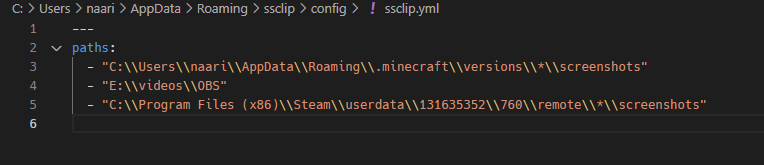

# ssclip

Tool for Windows to copy screenshots to the clipboard

## Feature

- Monitoring specific directory paths to get screenshots creation event, and Copy to the clipboard
- Supports glob (`?`, `*`, `**`, `[...]`, `[!...]`, etc...) patterns

## How to use

1. Download binary from [GitHub Releases](https://github.com/naari3/ssclip/releases)
1. Execute binary file
1. Edit and save your config files `%APPDATA%\ssclip\config\ssclip.yml`
1. Take screenshot and copies the image to the clipboard

## Autorun

This application resides in the task tray. Right click task tray icon and Check `Start ssclip on system startup` then should be added to Autorun.
